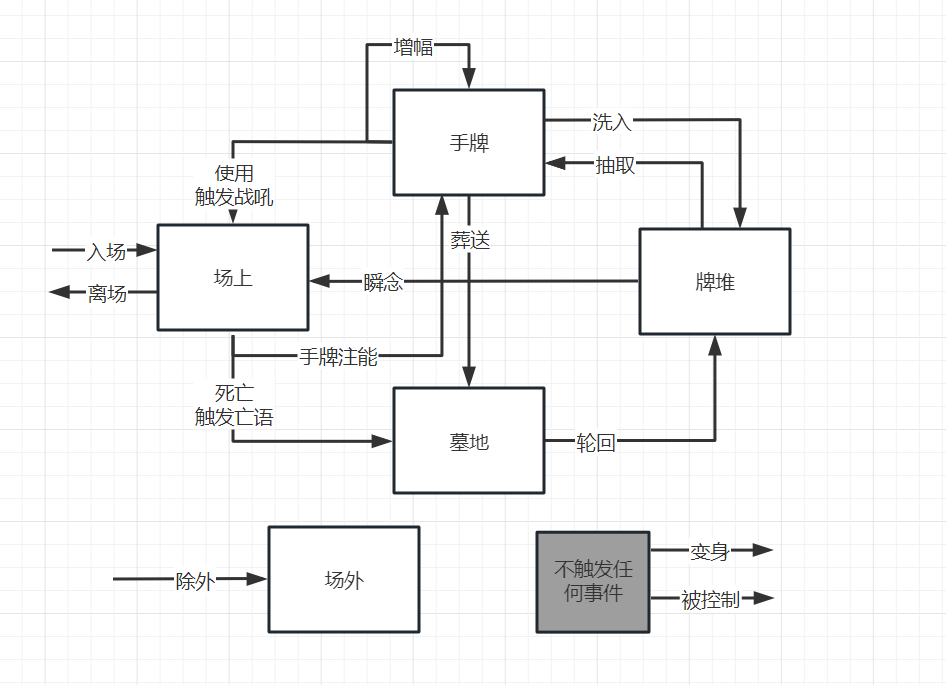
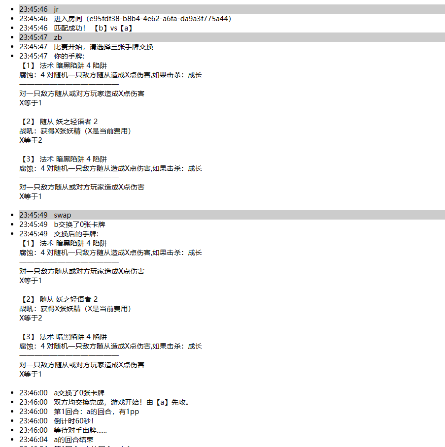
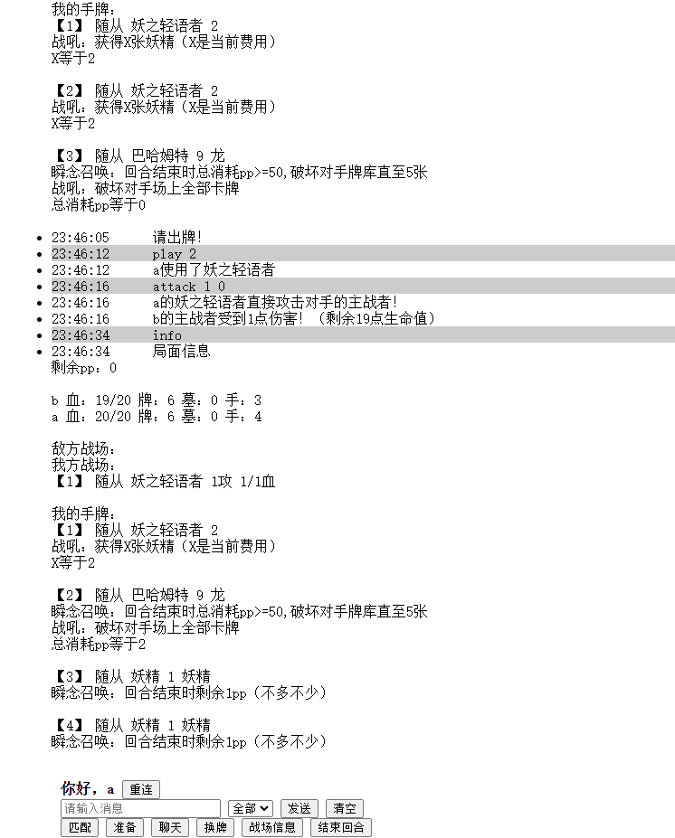
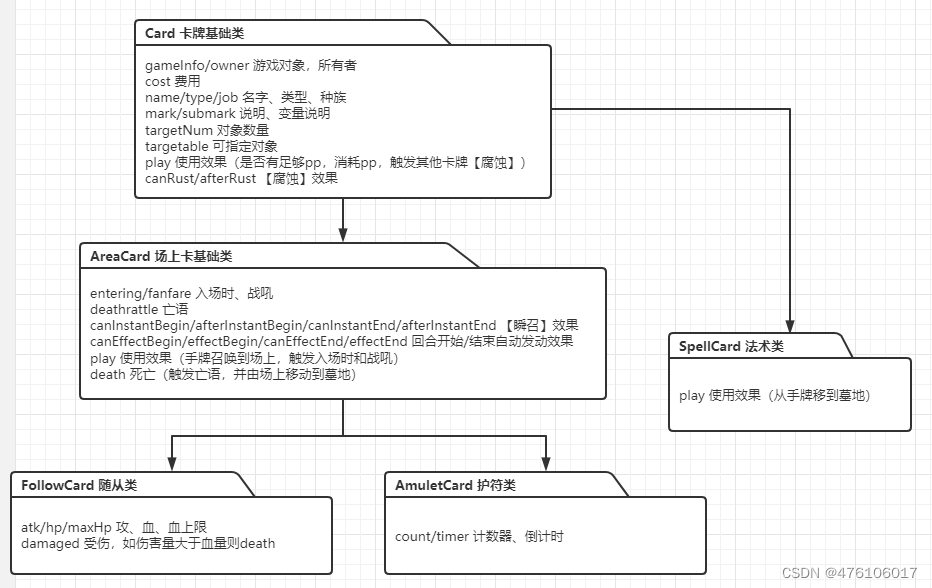
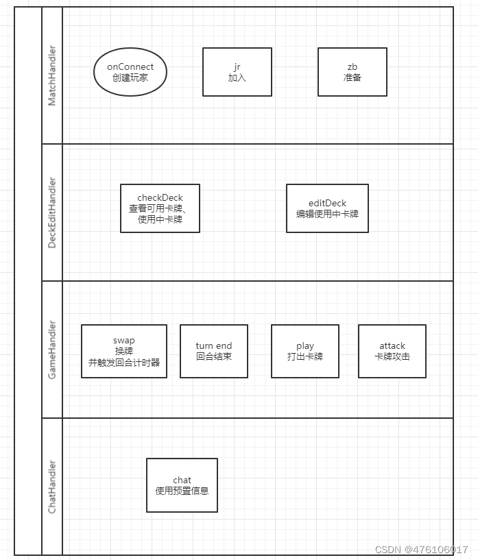

# ccg4j

可以看做影之诗（シャドバ）的fan made作品。以后可能会变成别的玩法。

目前的工作分支：feature-javawebsocket

## 试玩
http://www.card4j.top/

黑客大哥不要搞破坏欧！

## 开始
git拉不下来？
git config --global http.postBuffer 524288000
git config --global http.proxy 127.0.0.1:33210(端口改下你懂的)

1. 配置好jdk17、gradle
2. 不需要数据库、不需要中间件，直接启动Ccg4jApplication.main()
3. 在idea或者vscode里面选择用浏览器打开test.html。在localhost域名上跑起来。
4. 拿这个域名，换个浏览器，再开一个页面（相同浏览器只能玩一个号）
5. 两个页面左右互搏吧！
6. 或者把局域网ip发给局域网里的小伙伴，用局域网ip替换localhost，和小伙伴来场pk吧！

## 最新动态
#### 2023/03/23
已经很完美了。但是有个不协调的地方，netty-socketio有点过时了。现在的springboot自带了websocket，所以嘛，重构吧。
然后就是完全放弃后端渲染，比如效果描述之类的。想要做成api，这样可以更好的前后端合作。

#### 2023/01/25
JOJO的奇妙冒险非常好看。普奇神父的天堂制造把我震惊了——这也太强了吧

那就造张普奇神父的卡。只要抽到乔家人就能进化，进化的最后可以减双方PP最大值
并且增加攻击次数。这样对手就有一种绝望的感觉，当对手pp最大值只有1的时候重启游戏，
并且保留普奇神父、获得魔法免疫。在新一轮游戏中占尽优势。

#### 2023/01/25
很久没写动态，主要是进入了有点厌倦的时期，但是代码一直在写的。

写原神系统花了很多心思，主要是七圣召唤太无聊了，也没什么借鉴价值，所以原创了很多。
1. 普攻跟切换角色是2张可以重复使用的卡牌，所谓切换角色就是给一个角色上【守护】
2. 元素骰是随着pp增长而增长。这样才能跟其他卡组同等竞技。
2. pp可以算作“无元素”骰子，这样2费就有机会打出2点普攻伤害。
3. 法术牌不会有无元素的，这样随机性更强。比如心海的抽2，如果是1PP抽2张未免太强，
所以她抽2必须是消耗水元素骰子。
4. 脑袋一抽想到了小时候玩的dota火雷卡，火火雷的陨石，用元素骰就可以完美体现出来，
真是太棒了。顺便也加点其他卡尔技能。

#### 2023/01/02
因为配备了服务器。元旦期间进行了大量debug和用户体验改进。
把影之诗妖精职业卡干了一大片过来。。。对于影之诗好久都没更新的卡，我适当的调节了一下性能。
炉石的卡也干了几张，主要是爆牌贼的几张关键牌。
系统上预设牌组、跟主战者超抽效果也写好了。
debug也做了很多。
总之新年快乐。

#### 2022/12/31
新的一年，正是阖家团聚的时候。当然少不了麻将！

新增护符卡：【自动麻将桌】4费

双方抽牌时： 如果手牌费用符合门清自摸和，则获得游戏胜利

双方召唤时： 如果场上还有空间，对方以召唤牌的费用为参考，从手牌进行鸣牌并召唤到场上

这么神奇的卡牌其他卡牌游戏有吗？没有吧！ccg4j真NB！

算法写的好累TT

#### 2022/12/30
说到名字，自然少不了死亡笔记本儿。

如果场上随从名字没有改变，死亡笔记本就会在回合结束时消灭敌人。

如果对方拥有大量改名后的随从，那么可以在【抉择】选择更为偏激的方案————支付一半生命以曝光对方场上随从的真名

有夜神月的场合，夜神月将在回合结束计算击杀数量、并【返回】手牌以确保自身安全。在夜神月死亡时将会触发【亡语】化作对于对方主战者的直接伤害。

使用死亡笔记的人无法下地狱，所以装备者拥有【游魂】效果，死亡时候被直接除外不会触发亡语

夜神月的玩法就是让己方其他随从不断使用死亡笔记创造击杀，最后自己出场触发亡语，造成otk

#### 2022/12/29
控制别人的牌是一种非常特殊的设定，于是给支配恶魔加上了这个能力。

只要卡牌的名字未曾改变，支配恶魔每回合都可以生成支配之线，控制场上任意一个随从。

支配恶魔死亡时，由其控制的任意一个随从死亡来【召还】支配恶魔。

当然。。。因为支配是不分敌我的，破解的方法就是多使用突进随从或者法术牌，不要把强力随从放到场上任其支配。

甚至可以用一些低阶随从故意让其支配，使其卡住自己战场。

还能利用具有【除外】能力的卡牌，暂时让支配恶魔消失在战场。期待【恶魔转生】后来到你的牌堆中吧。

#### 2022/12/28
看链锯人有点上瘾了，于是做了几张链锯人职业牌。
电次可以吸血治疗自己、可以抹除恶魔的存在，这不就是很好的卡牌原型吗。
代码越写越嗨。。才发现List.of这个方法创建的不可变数组，还是基础不太行

因为传统的吸血效果是治疗主战者的，所以我用了【自愈】这个关键词，表现出电次越打血越多的能力。
还有【重伤】，打英雄联盟的时候很常见的关键词，但是那个是百分比组织治疗。卡牌游戏不要那么复杂，直接不可回复算了
最重要的是要表现恶魔可以无限转生的设定，于是我用了【恶魔转生】的关键词————当所属随从从游戏中【除外】时，可以在双方牌组中任意一张卡上转生（这个代码还没写）

写代码的时候脑袋里一直都是链锯的声音，怎么才能让玩家觉得自己在拉链锯呢？于是又学游戏王做了一种【装备卡】。可以随时开启链锯模式。
对了，还要debug。。。

#### 2022/12/27
总之先做出一套“炉石vs影之诗”的玩法吧,名字就叫shadowStone影之石传说怎么样。

交战时/攻击时/受伤时/击杀时 这套逻辑做的头大。任何一个节点都可能重新指定对象，或者对象已经消失了。

感觉系统已经做的差不多了，再就是做i18n、还有开始印卡了。

前路漫漫。。。

实验室招募员跟爆牌鱼已经印好了，这下该开始有趣起来了吧

## 玩法
`(SV：shadowverse HS：heartstone STS：SlayTheSpire)`
- [x] 匹配/准备
- [x] 开局换牌
- [x] 回合计时
- [x] 预置聊天语句
- [x] 特殊胜利/投降
- [x] 随从/法术/护符
- [x] 入场回合无法攻击/突进
- [x] 入场时/离场时
- [x] 战吼/亡语
- [x] 瞬念召唤/揭示(SV)
- [x] 腐蚀/注能（HS）->增幅/注能
- [x] 轮回(从墓地移到牌堆，重置属性)
- [x] 比赛计数器
- [x] 主战者效果（SV）
- [x] 主战者技能（HS）
- [x] 激励（HS）
- [x] 交战时/攻击时/受伤时/击杀时
- [x] 无法被破坏
- [x] 疾驰/守护/必杀/吸血
- [x] 回复时/自愈/重伤/无法回复/恶魔转生（将比赛中任意一张卡变成该卡）
- [x] 变身/召还/装备武器牌/真名/被控制
- [x] 游魂（死亡时直接除外）
- [x] 返回手牌
- [x] 抉择
- [x] 主战者底牌（不同主战者底牌不同：死神、胜利、疲劳等）
- [x] 占用卡槽/可重复张数
- [x] 在场时效果/移除在场时效果
- [ ] 死灵术/召还(SV)(召还会从墓地移除，防止反复召还，没有真实感)
- [x] 预设牌组
- [ ] 自定义牌组
- [ ] 诅咒牌
- [ ] ~~ep/进化（存在感太强了）~~
- [ ] ~~奥秘/陷阱（比较恶心）~~
- [ ] 英雄牌/任务牌（HS）
- [ ] 发现（HS）
- [ ] 激奏/结晶(SV)
- [ ] 葬送/弃牌(SV)
- [ ] AI对战/AI托管
- [ ] 剧情模式/剧情卡

## 职业/卡牌
`（希望以后能有各种离谱的职业。要做ccg游戏中的mugen）`
### 中立
- 巴哈姆特
- 哥布林旅行家
- 宏愿哥布林法师
- 寒光智者
- 暗黑陷阱（自创牌、测试腐蚀效果）
- 英雄：玩家（进化(0)：使一个己方随从获得+2/+2、突进）

### 妖精
- 森林交响乐（SV怀旧牌）
- 妖之轻语者
- 森林模式（自创牌、测试轮回效果）

### 复仇者
- 永恒之盾·席翁
- 灾祸模式（SV双职业模式中被禁了，怨念ing）
- 英雄：伊昂（虚空解析(2)：将1张手牌加入牌堆，召唤1个解析的造物）

### 潜行者
- 实验室招募员

### 链锯人
- 链锯恶魔
- 支配恶魔
- 暗之恶魔
- 
### 死亡笔记
- 夜神月
- 死亡笔记
- Lawliet
### Dota
### 原神
### LoL

## 游戏截图（早期版本）

## 设计相关

